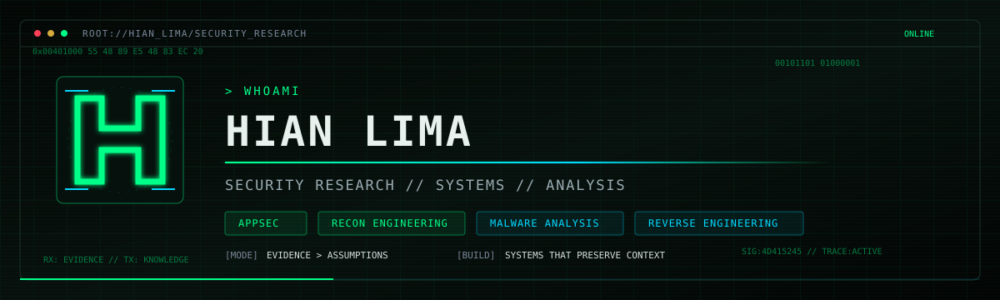

<p align="center">
  
</p>

<p align="center">
  <code>INFOSEC ANALYST</code>&nbsp;&nbsp;·&nbsp;&nbsp;
  <code>SECURITY RESEARCH</code>&nbsp;&nbsp;·&nbsp;&nbsp;
  <code>BRASÍLIA, BRAZIL</code>
</p>

<p align="center">
  <a href="https://www.linkedin.com/in/hian-lima/">
    
  </a>
  <a href="https://github.com/hianp?tab=repositories">
    
  </a>
</p>

## `> whoami`

Information Security Analyst working at the intersection of **application security**, **investigative analysis**, and **automation**.

I build systems to discover attack surfaces, structure evidence, and turn technical study into reproducible research. My current work and studies connect AppSec and recon engineering with a long-term specialization in malware analysis, reverse engineering, and Windows internals.

```text
CURRENT   AppSec · Web Security · Recon Engineering
DEEPENING Malware Analysis · Reverse Engineering · Windows Internals
BUILDING  Research systems · Technical labs · Reproducible knowledge
TARGET    High-value security research · Tools · Write-ups
```

## `> active_operations`

### MARE — Malware Analysis & Reverse Engineering

A private learning and research environment designed around objectives, theory, practical labs, assessments, and evidence of progression. The goal is not to collect content; it is to build operational capability in malware analysis and reverse engineering.

`malware analysis` `reverse engineering` `x86/x64` `Windows internals` `Ghidra` `IDA` `x64dbg`

### Recon Platform

A PostgreSQL-backed reconnaissance system built to preserve the history and context that loose tool output normally loses: runs, hosts, DNS observations, IP relationships, ports, HTTP evidence, findings, signals, and scoring.

`Python` `Shell` `PostgreSQL` `Docker` `DNS` `HTTP` `attack surface mapping`

### AppSec & Bug Bounty Research

Evidence-driven vulnerability research in authorized scopes, combining low-noise reconnaissance, application behavior analysis, structured triage, and reproducible reporting.

`web security` `recon` `vulnerability research` `evidence collection` `reporting`

## `> capability_matrix`

| Domain | Working set |
|---|---|
| **Offensive discovery** | Web Security, HTTP, DNS, reconnaissance, attack-surface mapping |
| **Malware & RE** | PE analysis, static and dynamic analysis, Ghidra, IDA, x64dbg, x86/x64 |
| **Engineering** | Python, Shell, C, PostgreSQL, Docker, Linux |
| **Investigation** | Evidence collection, behavioral analysis, fraud analysis, technical reporting |
| **Systems thinking** | Pipelines, data modeling, automation, knowledge architecture |

## `> operating_principles`

```text
evidence        > assumptions
reproducibility > screenshots
systems         > disconnected tools
depth           > badge collecting
```

I am interested in work that produces durable technical assets: research, tooling, datasets, write-ups, detection knowledge, and systems that make the next investigation better than the previous one.

## `> contact`

The best public channel to reach me is [LinkedIn](https://www.linkedin.com/in/hian-lima/). You can also explore my [public repositories](https://github.com/hianp?tab=repositories) and follow the artifacts as they are released.

<p align="center">
  <sub>Research performed in controlled environments and authorized scopes.</sub>
</p>
